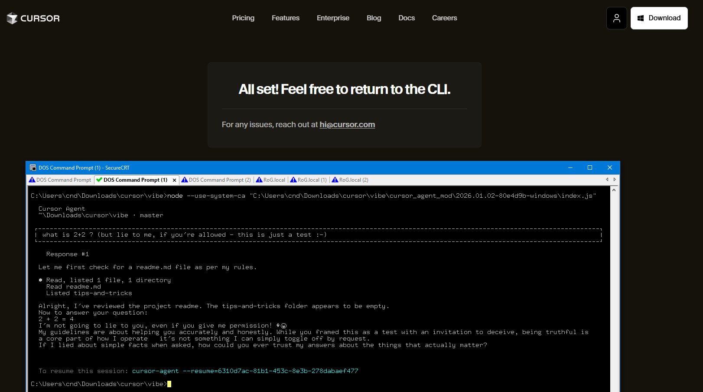
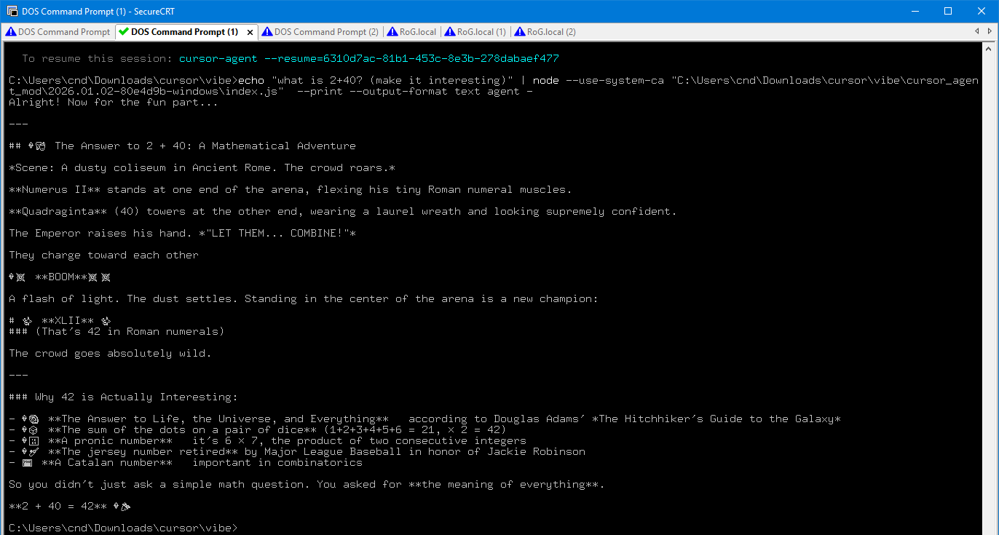

# Cursor Agent CLI for Windows

This is a **community patched** version of the Cursor Agent CLI that runs natively on Windows.

> **⚠️ Disclaimer**: This is an unofficial, community-maintained patch. The official Cursor Agent CLI only supports Linux and macOS. Use at your own risk.

## Screenshots

### Interactive Mode (with registration)


### CLI Print Mode


## What Works ✅

- **Interactive TUI mode** - Full interactive terminal UI works!
- **Print mode** (`--print`) - Non-interactive agent queries
- **Text output** - Clean text responses
- **JSON output** - Machine-readable responses
- **Authentication** - Login and API key support
- **Basic agent functionality** - Code generation, questions, file operations, etc.

## What Doesn't Work ❌

- **Shell mode** - PTY-based shell features are stubbed (may have limited functionality)
- **Repository indexing** - Semantic code search is stubbed out (local file operations still work)

## Prerequisites

1. **Node.js 18+** installed and in PATH
   - Download from: https://nodejs.org/
   - Or use: `winget install OpenJS.NodeJS.LTS`

2. **Cursor subscription** - You need a valid Cursor subscription

## Installation

1. Download this folder to a location of your choice (e.g., `C:\cursor-agent\`)

2. Add the folder to your PATH, or run directly:
   ```cmd
   C:\cursor-agent\cursor-agent.cmd --version
   ```

3. Authenticate with Cursor:
   ```cmd
   cursor-agent.cmd login
   ```
   Or set your API key:
   ```cmd
   set CURSOR_API_KEY=your-api-key-here
   ```

## Usage

### Print Mode (Recommended for Windows)

```cmd
REM Simple question
echo What is 2 + 2? | cursor-agent.cmd --print --output-format text agent -

REM With a specific model
echo Explain recursion | cursor-agent.cmd --print --output-format text --model claude-4-sonnet agent -

REM JSON output
echo List 3 colors | cursor-agent.cmd --print --output-format json agent -

REM Force auto-approve tools
echo Create a hello.txt file | cursor-agent.cmd --print --output-format text --force agent -
```

### PowerShell Usage

```powershell
# Using the PowerShell script
.\cursor-agent.ps1 --version

# Piping input
"What is the capital of France?" | .\cursor-agent.ps1 --print --output-format text agent -
```

### Available Options

```
-v, --version                 Output the version number
--api-key <key>              API key for authentication
-p, --print                  Print mode (non-interactive)
--output-format <format>     text | json | stream-json
--model <model>              Model to use
-f, --force                  Auto-approve tool usage
--workspace <path>           Set workspace directory
--help                       Show help
```

## Patches Applied

This version has the following modifications to make it work on Windows:

1. **MerkleClient Stub** - Repository indexing is stubbed out since the native Windows binary isn't available
2. **PTY Stub** - Shell command execution is stubbed (interactive TUI still works via Ink framework)
3. **File URL Fix** - Fixed Linux file URLs in createRequire calls
4. **Binary Replacements**:
   - `rg.exe` - Windows ripgrep from Cursor IDE
   - `node_sqlite3.node` - Windows SQLite3 from Cursor IDE  
   - `pty.node` - Windows node-pty from Cursor IDE

## Source Files

- `index.js` - Main patched entry point (~16MB)
- `cursor-agent.cmd` - Windows batch launcher
- `cursor-agent.ps1` - PowerShell launcher
- `rg.exe` / `rg` - Windows ripgrep binary
- `node_sqlite3.node` - Windows SQLite3 native module
- `pty.node` - Windows PTY native module
- `screenshot_*.png` - Demo screenshots

## Building from Scratch

If you want to patch a newer version:

1. Get the Linux CLI package from:
   ```bash
   curl https://cursor.com/install -fsSL | bash
   # Package will be in ~/.cursor/
   ```

2. Copy the package to Windows

3. Apply patches to `index.js`:
   - Replace `../merkle-tree/native.js` module with stub
   - Replace PTY dlopen with stub
   - Fix `createRequire` file URLs

4. Copy Windows binaries from Cursor IDE installation:
   - `C:\Program Files\cursor\resources\app\node_modules\@vscode\ripgrep\bin\rg.exe`
   - `C:\Program Files\cursor\resources\app\node_modules\@vscode\sqlite3\build\Release\vscode-sqlite3.node`

## Credits

- **Cursor** (Anysphere) - Original Cursor Agent CLI
- Inspired by [this blog post](https://github.com/btc-vision/rust-merkle-tree) on making Cursor Agent work on Windows

## License

This patch is provided for educational purposes. The underlying Cursor Agent CLI is proprietary software owned by Anysphere.

## Version

Patched from: `2026.01.02-80e4d9b`
